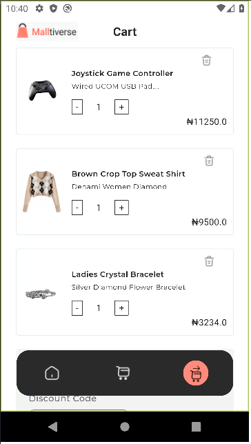
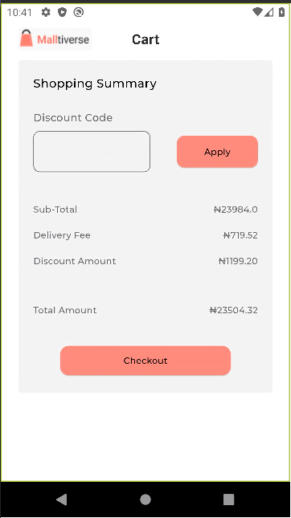
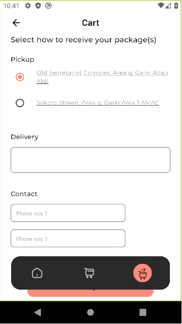
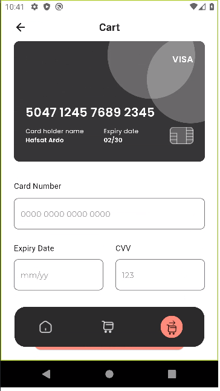
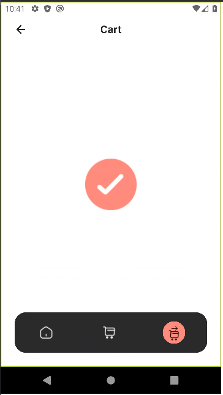

# Timbu Product Listing App

This Flutter application lists products hosted on Timbu Cloud, retrieves them via an API, and displays them in a list. This project was developed as part of an HNG internship task for stage 2.

## Features

- List products from Timbu Cloud
- Retrieve product data through an API
- Display product details in a Grid view
- Checkout & Payment

## Appetize Demo
[Demo Link](https://appetize.io/app/b_5nxmi4xwn3d5mdc75lqdufx3xm)

## Download Link
[Download Link](https://drive.google.com/file/d/13OddObnAiIfdGv6zGNy_eRLWqUE2zxDI/view?usp=sharing)

## Screenshots








## Instructions to Set Up

**Installation:**

1. **Ensure you have Flutter SDK installed on your machine. If not, refer to the official Flutter documentation for installation instructions: [Flutter Documentation](https://flutter.dev/docs/get-started/install)**


2. **Clone the repository:**

   ```bash
   git clone https://github.com/adebola-duf/hng11-stage-3.git
   ```

3. **Navigate to project directory**
    ```bash
    cd hng11-stage-2
    ```
4. **Install dependencies using Flutter:**
    ```bash
    flutter pub get
    ```

5. **Run the app on an emulator or a physical device:**
    ```bash
    flutter run
    ```
## Dependencies
- [http](https://pub.dev/packages/http): For making HTTP requests
- [google_fonts](https://pub.dev/packages/google_fonts): For fonts